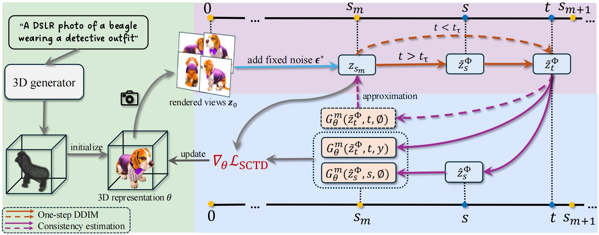

# SegmentDreamer: Towards High-fidelity Text-to-3D Synthesis with Segmented Consistency Trajectory Distillation
Jiahao Zhu, [Zixuan Chen](https://github.com/NarcissusEx), [Guangcong Wang](https://wanggcong.github.io/), [Yi Zhou✉️](https://zssom.sysu.edu.cn/teacher/ZhouYi), [Xiaohua Xie✉️](https://cse.sysu.edu.cn/teacher/XieXiaohua)

<!-- **[[Project Page]](https://zjhjojo.github.io/segmentdreamer/)** **[[Arxiv]](https://arxiv.org/abs/2507.05256)** -->
<div align="center">
  <a href="https://zjhjojo.github.io/segmentdreamer/"></a>
  <a href="arxiv"></a>
  <a href="https://www.youtube.com/watch?v=haUjuRgiis0"></a>
</div>

<div align=center>
 
 
 
</div>

## Abstract
Recent advancements in text-to-3D generation improve the visual quality of Score Distillation Sampling (SDS) and its variants by directly connecting Consistency Distillation (CD) to score distillation. However, due to the imbalance between self-consistency and cross-consistency, these CD-based methods inherently suffer from improper conditional guidance, leading to sub-optimal generation results. To address this issue, we present SegmentDreamer, a novel framework designed to fully unleash the potential of consistency models for high-fidelity text-to-3D generation. Specifically, we reformulate SDS through the proposed Segmented Consistency Trajectory Distillation (SCTD), effectively mitigating the imbalance issues by explicitly defining the relationship between self- and cross-consistency. Moreover, SCTD partitions the Probability Flow Ordinary Differential Equation (PF-ODE) trajectory into multiple sub-trajectories and ensures consistency within each segment, which can theoretically provide a significantly tighter upper bound on distillation error. Additionally, we propose a distillation pipeline for a more swift and stable generation. Extensive experiments demonstrate that our SegmentDreamer outperforms state-of-the-art methods in visual quality, enabling high-fidelity 3D asset creation through 3D Gaussian Splatting (3DGS).
<div align=center>
 
</div>

## Installation

```shell
conda create -n sctd python=3.9.16 cudatoolkit=11.8
conda activate sctd
pip install -r requirements.txt
pip install submodules/diff-gaussian-rasterization/
pip install submodules/simple-knn/
pip install submodules/point-e/
pip install tensorboard
```

## Training
```shell
# train script
python train.py --opt ./config/bagel.yaml --guidance_type sctd --phase_num 5 --num_ddim_timesteps 50 --guid_scale 7.5
```

## Citation 
```
@InProceedings{Zhu_2025_ICCV,
    author    = {Zhu, Jiahao and Chen, Zixuan and Wang, Guangcong and Xie, Xiaohua and Zhou, Yi},
    title     = {SegmentDreamer: Towards High-fidelity Text-to-3D Synthesis with Segmented Consistency Trajectory Distillation},
    booktitle = {Proceedings of the IEEE/CVF International Conference on Computer Vision (ICCV)},
    month     = {October},
    year      = {2025},
    pages     = {15864-15874}
}
```

## Acknowledgement
Our work is built upon [***LucidDreamer***](https://github.com/EnVision-Research/LucidDreamer/) and [***Connecting Consistency Distillation to Score Distillation for Text-to-3D Generation***](https://github.com/LMozart/ECCV2024-GCS-BEG). Thanks for their contributions to the 3D community!
